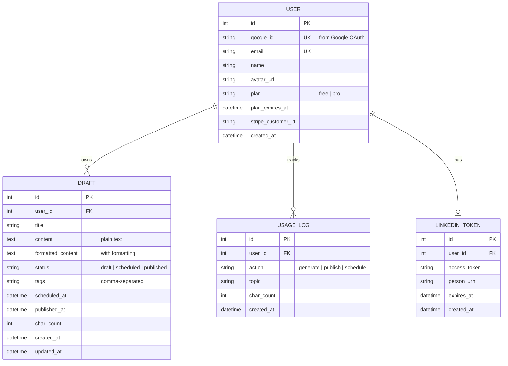

## 📋 PRD: LinkScale

> Transform LinkScale into a full **LinkedIn content management SaaS** — inspired by AuthoredUp, built to monetize.

---

## 🎯 Vision

A SaaS tool where LinkedIn creators **write, preview, schedule, and analyze** posts — all from one dashboard. Free tier hooks users; Pro ($9–19/mo) unlocks scheduling + analytics.

---

## 🎯 Target User & Positioning

- **Primary target user**
  - Solo LinkedIn creators and founder/creators who:
    - Post 2–7 times per week.
    - Want to plan content in batches and avoid “what do I post today?” stress.
    - Care more about quality and consistency than complex team workflows.

- **Secondary user (later phases)**
  - Small agencies / ghostwriters managing multiple LinkedIn profiles.
  - NOT in v1 scope, but kept in mind for future multi-account features.

- **Jobs-to-be-done**
  - “Keep a consistent pipeline of LinkedIn posts without spending hours every day.”
  - “Batch-create and schedule posts for the week in one sitting.”
  - “Understand which topics and formats perform best over the last 30–90 days.”

- **Positioning vs existing tools**
  - **Narrow focus**: LinkedIn-only (no Facebook/Twitter/Instagram bloat).
  - **Opinionated for creators**: Templates and flows tuned for solopreneurs/founders, not big marketing teams.
  - **Lightweight but powerful**: Simple, fast interface with core features (drafts, preview, schedule, analytics) and minimal configuration.

---

## 📸 Inspiration (AuthoredUp)

````carousel

<!-- slide -->

<!-- slide -->

<!-- slide -->

````

````

---

## 🕵️ Competitor Analysis & Advanced Capabilities (Prosp.ai)

> [!NOTE]
> Based on our analysis of Prosp.ai, our tool can evolve to compete with high-end outbound automation platforms by incorporating these advanced features in later phases.

### Key Learnings from Prosp.ai
- **Hyper-Personalized AI Messages:** AI reads the prospect's profile, recent posts, and overall online presence to write unique connection messages and DMs, moving beyond simple template tags like `{{first_name}}`.
- **Automated Voice Notes (Unique USP):** Sending customized AI voice notes or pre-recorded audio to connections, which drastically increases reply rates compared to simple text.
- **Unified Inbox & Multi-Account Management:** A single centralized dashboard to manage messages from *all* connected LinkedIn accounts simultaneously. This is essential for lead generation agencies.
- **Multi-Step Workflows:** Complex sequences that involve viewing profiles, waiting, liking posts, sending connection requests, and automated follow-ups.
- **Built-In Account Safety:** Using 1 Dedicated Residential Proxy per LinkedIn account to strictly mimic real human browsing behavior, heavily reducing the risk of bans.

### Proposed Additions for V3 Roadmap
- **Proxy Safety Integration:** Evolve from standard API calls or basic browser automation to using residential proxy support (or tools like `undetected_chromedriver`) to ensure stealth mode and account security.
- **Voice Note Generation:** Integrate an AI Audio API (like ElevenLabs) to synthesize personalized voice messages to prospects.
- **Multi-Persona Profiles / Unified Inbox:** Update DB structure to handle multiple `.env` or account sessions under one user account for agency deployment.
- **Advanced Sequence Builder:** Allow users to build visual workflows for outbound automated campaigns (e.g., view profile -> wait 24h -> connect -> drop voice note).

---

## 🚨 Known Blockers & Challenges

> [!CAUTION]
> Read this section carefully. These are the things that WILL cause problems if not handled upfront.

### 1. LinkedIn API Limitations

| Issue | Impact | Solution |
|-------|--------|----------|
| **Access token expires in 60 days** | Auto-publish stops working silently | Store expiry date in DB, show warning banner 7 days before, prompt re-auth |
| **Rate limit: 100 API calls/day** per user | Heavy users hit limit | Track API calls per user per day, show remaining quota |
| **LinkedIn app review required** for > 10 users | Can't scale without approval | Apply for LinkedIn Marketing Developer Platform early |
| **UGC Posts API may be deprecated** | LinkedIn pushes toward new Posts API | Build an abstraction layer so we can swap APIs without rewriting |

### 2. Scheduling Reliability

| Issue | Impact | Solution |
|-------|--------|----------|
| **Server restarts lose in-memory schedules** | Missed posts | Persist schedules in DB, reload on startup |
| **Free hosting sleeps after 15 min idle** (Render) | Scheduled posts fail | Use a cron ping service (cron-job.org, free) to keep alive, OR upgrade to paid |
| **Timezone handling** | Post at wrong time | Store all times in UTC, convert to user's timezone in UI |
| **Duplicate posts on retry** | Embarrassing for user | Add idempotency key per scheduled post, check before posting |

### 3. Google OAuth

| Issue | Impact | Solution |
|-------|--------|----------|
| **OAuth consent screen review** | Google shows "unverified app" warning | Submit for verification before launch (takes 2-4 weeks) |
| **Refresh token expiry** | User gets logged out | Use refresh tokens properly, handle re-auth gracefully |
| **Multiple Google accounts** | Confusing UX | Show which account is logged in, allow account switching |

### 4. Data & Storage

| Issue | Impact | Solution |
|-------|--------|----------|
| **SQLite doesn't support concurrent writes** | Crashes with multiple users | Start with SQLite for dev, switch to PostgreSQL BEFORE going multi-user |
| **Draft content can be large** (formatting + images) | DB bloat | Set max draft size (50KB), compress formatted content |
| **No backup strategy** | Data loss | Daily automated DB backup (pg_dump to S3 or just export) |

### 5. Payments (Stripe)

| Issue | Impact | Solution |
|-------|--------|----------|
| **Webhook failures** | User pays but doesn't get Pro | Implement retry logic + manual override endpoint |
| **Cancellation edge cases** | Access after cancel? | Pro access until billing period ends, then downgrade |
| **Indian regulations** | RBI recurring payment rules | Use Stripe Checkout (handles compliance), not raw API |

---

## 🏗️ Architecture & Code Quality Standards

> [!IMPORTANT]
> Follow these from Day 1. Refactoring later is 10x harder.

### Project Structure (Target)

```
linkscale/
├── app/
│   ├── __init__.py          # App factory (create_app)
│   ├── config.py            # All config in one place
│   ├── models.py            # SQLAlchemy models
│   ├── extensions.py        # db, login_manager, etc.
│   │
│   ├── auth/                # Blueprint: login, OAuth, register
│   │   ├── __init__.py
│   │   ├── routes.py
│   │   └── services.py
│   │
│   ├── editor/              # Blueprint: post editor, AI generation
│   │   ├── __init__.py
│   │   ├── routes.py
│   │   └── services.py
│   │
│   ├── drafts/              # Blueprint: drafts CRUD, filters
│   │   ├── __init__.py
│   │   ├── routes.py
│   │   └── services.py
│   │
│   ├── calendar/            # Blueprint: calendar, scheduling
│   │   ├── __init__.py
│   │   ├── routes.py
│   │   └── services.py
│   │
│   ├── analytics/           # Blueprint: usage stats, dashboard
│   │   ├── __init__.py
│   │   ├── routes.py
│   │   └── services.py
│   │
│   ├── payments/            # Blueprint: Stripe integration
│   │   ├── __init__.py
│   │   ├── routes.py
│   │   └── services.py
│   │
│   ├── templates/           # All HTML templates
│   │   ├── base.html        # Master layout (sidebar + main)
│   │   ├── auth/
│   │   ├── editor/
│   │   ├── drafts/
│   │   ├── calendar/
│   │   └── analytics/
│   │
│   └── static/              # CSS, JS, images
│       ├── css/
│       ├── js/
│       └── img/
│
├── migrations/              # DB migrations (Flask-Migrate)
├── tests/                   # Unit + integration tests
├── .env                     # Secrets (gitignored)
├── .env.example
├── Dockerfile
├── Procfile
├── requirements.txt
└── run.py                   # Entry point
```

### Code Patterns to Follow

| Pattern | What | Why |
|---------|------|-----|
| **App Factory** | `create_app()` function | Testable, configurable, no circular imports |
| **Blueprints** | Separate module per feature | Clean separation, each feature is self-contained |
| **Service Layer** | Business logic in `services.py`, not in routes | Routes stay thin, logic is reusable and testable |
| **Config Classes** | `DevelopmentConfig`, `ProductionConfig`, `TestingConfig` | Environment-specific settings without conditionals |
| **DB Migrations** | Flask-Migrate (Alembic) | Track schema changes, rollback safely |
| **Error Handling** | Custom error handlers + JSON error responses | Consistent API errors, no stack traces in production |
| **Logging** | Structured logging per module | Already have this, extend to all blueprints |
| **Environment vars** | ALL config via `.env` | No hardcoded secrets, 12-factor app |

### API Response Format (Consistent)

```python
# Success
{"success": True, "data": {...}, "message": "Post saved"}

# Error
{"success": False, "error": "Post too long", "code": "VALIDATION_ERROR"}
```

---

## 🗺️ Phased Roadmap

| Phase | Name | Key Deliverables | Status |
|-------|------|-----------------|--------|
| **1** | Foundation | Google OAuth, DB, dashboard shell, sidebar nav | ✅ Completed |
| **2** | Rich Editor + Preview | Formatting toolbar, live LinkedIn preview, drafts | ✅ mostly Completed |
| **3** | Calendar + Scheduling | Weekly calendar, schedule posts, auto-publish | ✅ Completed |
| **4** | Drafts Management | Table view, filters, tags, export | ✅ Completed |
| **5** | Analytics + Monetization | Usage stats, Stripe, Free/Pro tiers | ⏳ Pending (Stripe pending) |

---

## 📦 MVP Scope & Success Metrics

### MVP feature cut (v1)

**In scope for first public launch**
- Google OAuth sign-in.
- Simple post editor (text + basic formatting) with live LinkedIn-style preview.
- Drafts: create, edit, delete, save as draft.
- Scheduling: schedule one-time posts to LinkedIn for a chosen datetime.
- Simple “My posts” list with status (draft / scheduled / published) and basic metrics (if available).
- Free vs Pro:
  - Free: create drafts, limited AI generations, manual copy-paste posting, max 3 active scheduled posts.
  - Pro: auto publish to LinkedIn, more scheduled posts, basic analytics.

**Out of scope for MVP**
- Complex calendar UI (week/month grid with drag-and-drop).
- Tags and advanced filters for drafts.
- Deep analytics slicing and export.
- Agency features (multi-account, team collaboration, approvals).

### MVP success metrics

- **Activation**
  - ≥ 60% of new signups connect LinkedIn and create at least 1 draft within 24 hours.
- **Engagement**
  - ≥ 50 active creators (last 30 days) with ≥ 5 scheduled or published posts via the tool.
- **Monetization**
  - Target: first 10–20 paying Pro users within 60 days of MVP launch.
- **Quality**
  - < 2% of scheduled posts fail due to system errors (excluding LinkedIn outages or user token expiry).

---

## 🔧 Tech Stack

| Layer | Technology | Why |
|-------|-----------|-----|
| **Backend** | Flask + Blueprints | Modular, scalable |
| **Database** | SQLite (dev) → PostgreSQL (prod) | Zero-config → scalable |
| **Auth** | Google OAuth 2.0 (via `authlib`) | No passwords to manage, trusted login |
| **ORM** | Flask-SQLAlchemy + Flask-Migrate | Models + migrations |
| **Scheduler** | APScheduler (persistent, DB-backed) | Works without Redis |
| **Frontend** | Vanilla HTML/CSS/JS | No build step, fast |
| **Payments** | Stripe Checkout | Hosted payment page, handles compliance |
| **Deployment** | Render | Already configured |

---

## 📐 Database Schema



---

## 🔐 Security, Auth & Session Management

### Session & cookie hardening

- Use Flask-Login sessions with:
  - `SESSION_COOKIE_SECURE = True` (HTTPS only in production).
  - `SESSION_COOKIE_HTTPONLY = True` (not accessible via JS).
  - `SESSION_COOKIE_SAMESITE = 'Lax'` or `'Strict'` (CSRF protection).
- Strong, random `SECRET_KEY` loaded from environment; rotated if compromised.
- Session lifetime:
  - Absolute expiry (e.g. 7 days).
  - Idle timeout (e.g. 24 hours of inactivity).

### Google OAuth best practices

- Request **minimal scopes** (profile + email) unless more are truly needed.
- Use OAuth `state` parameter to protect `/auth/callback` from CSRF attacks.
- Handle multiple Google accounts:
  - Primary identifier is `google_id`; email is mutable.
  - If email changes, update user record but keep `google_id` as the identity link.

### LinkedIn token security

- Store LinkedIn access tokens in `LINKEDIN_TOKEN` **encrypted at rest**:
  - Server-side encryption key from env (e.g. AES key), never stored in DB or code.
  - Never log access tokens or full LinkedIn responses containing tokens.
- Track:
  - `expires_at` from LinkedIn.
  - `last_used_at` (optional) for audits and to identify stale tokens.

### Access control & multi-tenancy

- All queries on `DRAFT`, `USAGE_LOG`, `LINKEDIN_TOKEN` must be scoped by `current_user.id`.
- Consider soft delete fields:
  - `deleted_at` on `DRAFT` to support restores and avoid ID reuse surprises.

---

## 🕒 Scheduling & Reliability (Extended)

- Single dedicated **scheduler worker** process:
  - Only one process is responsible for executing scheduled jobs to avoid duplicate publishes.
  - Web app instances do not run APScheduler jobs.
- Job execution model:
  - Jobs persisted in DB (via APScheduler or custom `SCHEDULED_JOB` table).
  - Row-level locking or “job ownership” fields (`locked_by`, `locked_at`) to avoid double execution.
- Time & timezone:
  - All times stored in UTC in DB.
  - User timezone stored separately (IANA name) and used only in UI for display and selection.
- Delivery status:
  - Each scheduled post has delivery status: `pending | sent | failed`.
  - Store external response IDs (e.g. LinkedIn post URN) and error messages for failures.
- Visibility:
  - In the dashboard, show upcoming posts and any failures with reasons.
  - Optionally email Pro users on failure with clear next steps.

---

## 💳 Payments & Plans (Extended)

### Stripe integration

- Use **Stripe Checkout** and **Customer Portal** for:
  - Starting subscriptions.
  - Updating payment methods.
  - Canceling subscriptions.
- Webhook security:
  - Verify incoming webhooks with Stripe’s signing secret.
  - Reject requests that fail signature or are too old (replay protection).

### Plan state & audits

- Treat Stripe as **source of truth** for subscription state.
- `USER.plan` and `USER.plan_expires_at` are cached views, updated:
  - On webhook events (checkout completed, invoice paid, subscription updated/canceled).
  - Optionally, on login if last sync is older than a threshold (e.g. 24 hours).
- Maintain a simple `PLAN_AUDIT_LOG` (optional) with:
  - `user_id`, `old_plan`, `new_plan`, `reason` (webhook/manual), `stripe_event_id`, `created_at`.

### Free vs Pro line

- Free tier:
  - Can write drafts and generate a small number of AI suggestions.
  - Can manually copy content to LinkedIn.
  - Limited to a small number of active scheduled posts (e.g. 3).
- Pro tier:
  - Auto-publish to LinkedIn.
  - Larger quota of active scheduled posts.
  - Access to analytics and historical insights (Phase 5).

---

## 🔐 Rate Limiting & Abuse Protection

- Per-IP and per-user rate limits:
  - Login attempts (e.g. max 10 attempts / 15 minutes / IP).
  - AI generations (e.g. configurable per plan).
  - Scheduling/publishing actions (e.g. cap posts per day).
- Abuse safeguards:
  - Simple flags per user: `is_blocked`, `restricted_until`, and reason.
  - Ability to disable scheduling/publishing quickly for specific users if they abuse the platform or violate LinkedIn ToS.

---

## 🧱 Environment, Config & Secrets

- Separate environments:
  - `APP_ENV` in `{development, staging, production}`.
  - Different DBs, OAuth credentials, Stripe keys per environment.
- Production:
  - `DEBUG = False`.
  - Behind HTTPS with TLS.
  - Served by a proper WSGI server (e.g. gunicorn) not Flask dev server.
- `.env.example` documents all required variables:
  - Flask secret key.
  - Google OAuth client ID/secret.
  - LinkedIn app credentials.
  - Stripe public/secret keys + webhook signing secret.
  - Database URL.
  - Encryption key for LinkedIn tokens.

---

## 🧪 Monitoring, Logging & Observability

- Structured logging:
  - Log in JSON (optional) with fields: `timestamp`, `level`, `user_id`, `request_id`, `job_id`, `action`, `status`, `error`.
  - Correlate requests, background jobs, and external API calls via IDs.
- Metrics to track from day 1:
  - Number of scheduled posts, successful publishes, failed publishes.
  - OAuth failures.
  - Stripe webhook failures.
  - App error rate (HTTP 5xx) and latency on key endpoints.
- Alerts:
  - Threshold-based alerts (e.g. >5 failed publishes in 5 minutes).
  - Notification channel (email/Slack) documented.

---

## 🧑‍💻 Onboarding, Activation & Retention

- First session flow:
  - Sign in with Google.
  - Prompt to connect LinkedIn (if not connected).
  - Guide to create first draft and schedule or publish it.
- In-app checklist (for new users):
  - [ ] Connect LinkedIn.
  - [ ] Create first draft.
  - [ ] Schedule first post.
  - [ ] Review simple analytics after first post publishes.
- Templates:
  - Provide 5–10 preconfigured post templates (founder story, lesson learned, case study, announcement, etc.) to avoid blank-page paralysis.
- Retention nudges:
  - Optional weekly email showing:
    - Posts scheduled/published that week.
    - Best-performing post.
    - Simple suggestion: “You have 0 posts scheduled for next week; create 2 now.”

---

## 📜 Risk Register (Business + Technical)

Each risk has: impact, likelihood, mitigation, contingency.

- **LinkedIn API policy changes or app rejection**
  - Impact: High, Likelihood: Medium.
  - Mitigation: Stay within ToS, avoid spammy or automated engagement features, keep usage moderate in early days, prepare app review docs early.
  - Contingency: Pivot to “assistive” tool with manual copy-paste workflows while re-applying or adjusting scopes.

- **Abuse / spam by users**
  - Impact: High (can trigger bans), Likelihood: Medium.
  - Mitigation: Rate limits, abuse flags, simple content guidelines in ToS.
  - Contingency: Rapidly disable offending users, temporarily suspend auto-publish if needed.

- **Stripe or payment failures**
  - Impact: Medium–High, Likelihood: Low–Medium.
  - Mitigation: Webhook verification + retries, manual override tooling, clear logs.
  - Contingency: Extend Pro access manually for affected users, communicate transparently.

- **Scheduler outages**
  - Impact: Medium–High, Likelihood: Medium.
  - Mitigation: Health checks, monitoring, single dedicated worker.
  - Contingency: Notify users of impact window, provide way to quickly reschedule missed posts.

- **Founder bandwidth / bus factor**
  - Impact: Medium, Likelihood: Medium.
  - Mitigation: Clean architecture, docs, minimal but clear runbook, automated deploys.
  - Contingency: Scope discipline; avoid features that are operationally heavy.

---

## 💾 Backups, Restore & Data Retention

- Backups:
  - Automated daily DB backups (e.g. `pg_dump` to object storage).
  - Store at least 7–30 days of backups (configurable).
  - Periodic **restore tests** (e.g. monthly) into a non-production environment to verify backups are valid.
- Recovery objectives:
  - Recovery Point Objective (RPO): ≤ 24 hours of data loss in worst case.
  - Recovery Time Objective (RTO): ability to restore and bring app back within ≤ 4 hours for major incidents.
- Data retention & privacy:
  - Define retention periods:
    - Drafts: kept until user deletes; soft delete may retain for a short grace period.
    - Usage logs: kept for analytics (e.g. 12–24 months) then aggregated or deleted.
    - Access tokens: removed when user disconnects LinkedIn or deletes account.
  - Provide a simple **“delete my data”** path:
    - In-app or via support, documented in privacy policy.

---

## 🎚️ Feature Flags & Operational Safety Switches

- High-risk features (auto-publish, certain analytics, bulk scheduling) should be behind **feature flags**:
  - Ability to disable per-environment (dev/staging/production).
  - Ability to disable globally for all users in emergencies without deploy.
- Operational controls:
  - Admin ability to:
    - Temporarily disable all new scheduling.
    - Pause all publishing workers while still allowing drafting.
    - Turn off AI generation if costs or abuse spike.

---

## 🧭 Product Checkpoints & Kill/Pivot Criteria

- Checkpoint after MVP launch (e.g. 60 days):
  - If < 50 active creators (last 30 days) or < 10 paying users, revisit:
    - Positioning (target niche, messaging).
    - Pricing.
    - Acquisition strategy.
- Ongoing evaluation:
  - If support or operational load becomes too high relative to user base, prioritize:
    - Simplifying features.
    - Improving self-service onboarding and docs.
- Clear decision framework:
  - Keep building when user engagement and willingness to pay are trending up.
  - Consider pivoting or pausing if usage remains low despite shipping key features and doing basic marketing.

---

## 📦 Phase 1: Foundation

> **Goal:** Google OAuth + DB + dashboard shell

### Auth Flow

```
User clicks "Sign in with Google"
        │
        ▼
Redirect to Google OAuth consent screen
        │
        ▼
Google redirects back to /auth/callback
        │
        ▼
Server gets user email, name, avatar
        │
        ▼
Create user in DB (or find existing)
        │
        ▼
Set Flask-Login session → redirect to /dashboard
```

### Pages

| Route | Page | Auth Required |
|-------|------|--------------|
| `/` | Landing page (hero + sign in) | No |
| `/auth/google` | Redirect to Google OAuth | No |
| `/auth/callback` | OAuth callback | No |
| `/auth/logout` | Clear session | Yes |
| `/dashboard` | Main dashboard | Yes |
| `/dashboard/new` | Post editor (Phase 2) | Yes |
| `/dashboard/drafts` | Drafts list (Phase 4) | Yes |
| `/dashboard/calendar` | Calendar (Phase 3) | Yes |
| `/dashboard/analytics` | Analytics (Phase 5) | Yes |

### Guest Mode

- 3 free AI generations tracked via session cookie (no login needed)
- After 3 uses: show "Sign in with Google for unlimited access"
- Guest data is NOT persisted to DB

### Success Criteria

- [ ] Google OAuth login works end-to-end
- [ ] User stored in DB with Google profile info
- [ ] Dashboard renders with sidebar navigation
- [ ] Guest mode allows 3 generations → then blocks
- [ ] Logout works

---

## 📦 Phase 2–5: (Unchanged from v1)

See detailed specs for each phase in the sections above in previous PRD version. Key change: all auth references now use Google OAuth instead of email/password.

---

## ✅ Pre-Flight Checklist (Before Writing Code)

> [!IMPORTANT]
> Complete these BEFORE starting Phase 1 code:

- [ ] **Set up Google OAuth credentials** at `https://console.cloud.google.com` — create OAuth 2.0 Client ID
- [ ] **Restructure project** into app factory + blueprints pattern
- [ ] **Set up Flask-Migrate** for database migrations
- [ ] **Create `base.html`** master template (sidebar + main area)
- [ ] **Create `config.py`** with Dev/Prod/Test configs
- [ ] **Add `authlib`** to requirements for Google OAuth
- [ ] **Define environment variables** in `.env.example` (Flask secret, DB URL, Google, LinkedIn, Stripe, encryption key)
- [ ] **Implement basic logging & metrics** (at least for auth, scheduling, publishing, Stripe webhooks)

